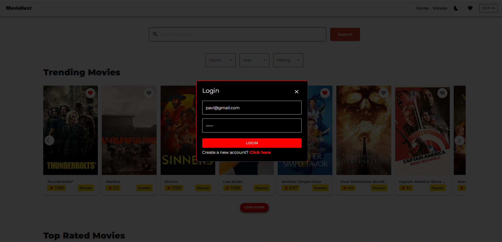

# 🎬 MovieHunt - Movie Explorer

**Live Demo:** [https://your-movie-explorer.vercel.app](https://your-movie-explorer.vercel.app)  
**GitLab Repo:** [https://gitlab.com/yourusername/movie-explorer](https://gitlab.com/yourusername/movie-explorer)

---

## 📖 Project Description

**MovieHunt - Movie Explorer** is a modern web application built with React that enables users to search, explore, and discover movies using real-time data from [The Movie Database (TMDb)](https://www.themoviedb.org/). Users can view trending films, search for specific titles, read detailed information, and save favorites locally. The app features a clean UI with light/dark mode and responsive design for mobile,tablet and desktop devices.

---

## 🚀 Features

### 🔐 Authentication
- Simple login interface with username and password input (local/session-based handling).

### 🔍 Movie Search
- Search bar connected to TMDb API for real-time movie suggestions.
- Search results displayed in a responsive grid layout.

### 🎞️ Movie Display
- Each movie card shows title, release year, and rating.
- Clicking a movie opens a detailed view: overview, genres, cast, and trailers.
- Movie trailers embedded using YouTube link from TMDb.

### 🌟 Trending Section
- Shows currently trending movies using the TMDb trending endpoint.

### 💡 User Experience
- Light/Dark mode toggle for theme switching.
- Handles API errors and empty results with user-friendly messages.
- Mobile-first responsive UI.
- Smooth page navigation using React Router.

### ❤️ Favorites & Local Storage
- Users can mark and store favorite movies locally.
- Last searched movie stored in local storage for session persistence.

---

## 🧰 Tech Stack

- **React** – UI and component logic  
- **React Router DOM** – Routing and page navigation  
- **Redux** – State management  
- **Axios** – For API communication  
- **Material UI (MUI)** – UI styling and components  
- **TMDb API** – Movie data, search, and trending  
- **Vercel / Netlify** – App deployment  

---

## 📸 Screenshots


|  |  |
|-------------------------------------------------------|----------------------------------------------------------|


|  |  |
|-------------------------------------------------------------|----------------------------------------------------------|


|  |  |
|-------------------------------------------------------------|------------------------------------------------------------|


|  |  |
|-------------------------------------------------------------|----------------------------------------------------------|


## ⚙️ Installation & Setup Instructions

### 1️⃣ Clone the Repository
```sh
git clone https://github.com/yehaniharshika/movie-explorer-loons-lab.git
```

### 2️⃣ Install Dependencies
```sh
npm install
```

### 3️⃣ Run the project
```sh
npm run dev
```